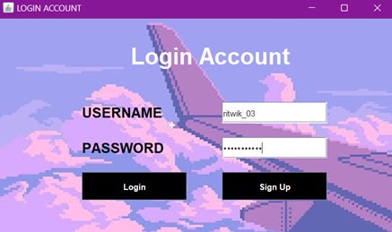
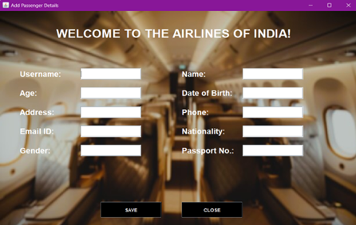
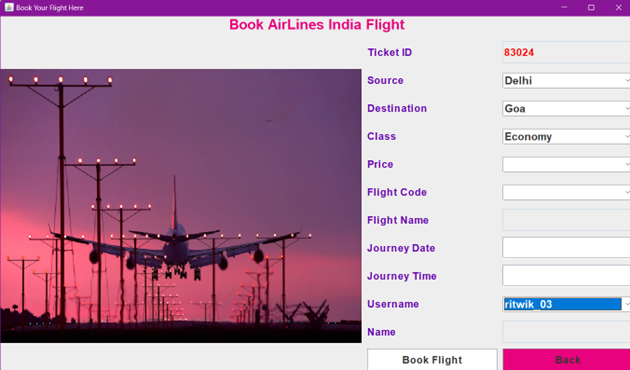

# ✈️ Flight Operations Platform

A full-fledged **Java Swing + AWT** based Flight Management System built with a **MySQL** backend. This application provides a user-friendly interface for managing flight bookings, passenger information, cancellations, and more — all in one seamless GUI system.

---

## 📸 Visual Overview

<p align="center">
  
  <br>
  
  <br>
  
  <br>
  
</p>

---
## 🛠️ Tech Stack

| Category              | Tech                   |
|-----------------------|------------------------|
| Programming Language  | Java                   |
| GUI Framework         | Swing, AWT             |
| Database              | MySQL                  |
| DB Connectivity       | JDBC                   |
| IDE Used              | NetBeans / IntelliJ    |

---

## 🚀 Features

- 👤 **Passenger Management** – Add, update, and delete passenger details.
- 📅 **Flight Booking** – Book flights with real-time input forms.
- 📋 **View Booked Flights** – Retrieve and view all booking records.
- ❌ **Cancel Flights** – Cancel flights and log cancellations to the database.
- 🧮 **Auto-generated IDs** – Unique ID creation for passengers and bookings.
- 🪟 **Multi-window GUI** – Seamlessly connected screens for operations.

---

## 📁 Folder Structure

Flight-Operations-Platform/
├── src/
│ ├── AddPassengerDetails.java
│ ├── bookFlight.java
│ ├── CancelFlight.java
│ ├── CheckPaymentDetails.java
│ ├── ConnectionClass.java
│ ├── FlightJourney.java
│ ├── FlightJourneyDetails.java
│ ├── FlightZone.java
│ ├── HomePage.java
│ ├── LoginPage.java
│ ├── SignupMessage.java
│ ├── UpdatePassenger.java
│ ├── ViewBookedFlight.java
│ ├── ViewCanceledTicket.java
│ └── ViewPassengers.java
├── icons/
│ └── (images/resources used in GUI)
├── database/
│ └── flightdb.sql
├── screenshots/
│ └── *.png
└── README.md

---

## 🧠 Concepts Used

- Java Swing & AWT for GUI design
- JDBC for database connectivity
- MySQL queries and table design
- Exception handling and input validation
- Modular Java class structure

---

## ⚙️ Setup Instructions

1. **Clone this repo:**
   ```bash
   git clone https://github.com/RitzwiK/Flight-Operations-Platform.git
2. Import into IDE:
Recommended: NetBeans or IntelliJ IDEA with GUI support.

3. Configure Database:

Start your MySQL server.

Import flightdb.sql from the database/ folder.

Update JDBC connection strings in the Java files if needed.

4. Run the application:

Launch Main.java from your IDE.

5. Login:

Use dummy credentials or create a new user via the AddCustomer screen.

📝 Database Tables
| Table Name     | Purpose                              |
| -------------- | ------------------------------------ |
| `customer`     | Stores passenger details             |
| `flight`       | Flight data (ID, destination, price) |
| `bookedflight` | Booking history                      |
| `cancelFlight` | Cancellation logs                    |

📌 Future Improvements
•User authentication system

•Real-time flight availability

•Cleaner UI/UX using JavaFX or web-based frontend

•Admin vs User roles

